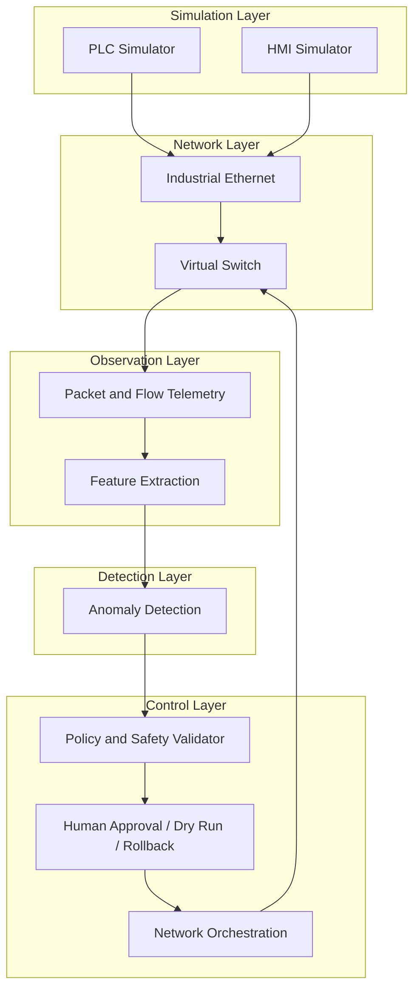

# SafeAI-OT

> Status: Under development — project architecture and implementation plan in progress.

**SafeAI-OT: Safe AI-Assisted Anomaly Detection and Network Orchestration for Industrial Ethernet**

SafeAI-OT will investigate whether AI can assist industrial-network monitoring and orchestration in a controlled, virtual testbed—without granting an LLM unrestricted control over the network.

This project is being developed as a research demonstrator aligned with a proposed ABB thesis topic on Ethernet-based industrial networks. It will explore how lightweight ML and policy-constrained automation can support operator trust, rapid anomaly identification, and reversible network actions in environments where PLC and HMI communication must remain reliable.

> **Disclaimer:** SafeAI-OT is under active development. Planned features, technologies, metrics, and deliverables described in this document must **not** be presented as completed work. This project does not claim ABB endorsement, access to ABB or customer industrial infrastructure, or readiness for production deployment.

## Table of contents

1. [Problem and motivation](#1-problem-and-motivation)
2. [Project scope](#2-project-scope)
3. [Architecture and data flow](#3-architecture-and-data-flow)
4. [Planned technology stack](#4-planned-technology-stack-not-yet-implemented)
5. [Network scenarios](#5-network-scenarios)
6. [ML pipeline](#6-ml-pipeline)
7. [Safe orchestration design](#7-safe-orchestration-design)
8. [Evaluation plan](#8-evaluation-plan)
9. [Thesis framing](#9-thesis-framing)
10. [Implementation roadmap](#10-implementation-roadmap)
11. [CV and application section](#11-cv-and-application-section)
12. [Related work](#12-related-work)

---

## 1. Problem and motivation

Industrial Ethernet networks in automation environments must simultaneously provide:

- **Reliable PLC and HMI communication** — control traffic must remain predictable and low-latency.
- **Protection against abnormal or malicious traffic** — unauthorized writes, scans, and floods must be detectable without false-alarm fatigue.
- **Rapid identification of failures** — link degradation, device unavailability, and latency spikes must be surfaced quickly.
- **Controlled and reversible network reconfiguration** — mitigations must be bounded, auditable, and undoable.
- **Human-understandable explanations** — operators need evidence and rationale, not opaque alerts.

Traditional monitoring tools excel at visibility but often leave operators to interpret raw telemetry under time pressure. Fully autonomous agents promise faster response but introduce unacceptable risk if they can execute unrestricted commands on live industrial infrastructure.

SafeAI-OT will investigate a middle path: **AI-assisted anomaly detection and network orchestration bounded by deterministic safety policies, human approval, and rollback mechanisms.** The project will not begin by giving an LLM direct shell or switch control. Instead, it will explore how structured telemetry, traditional ML, and optional LLM-based explanation can support human operators in a virtual Modbus/TCP industrial testbed.

---

## 2. Project scope

### MVP in scope

The minimum viable product will include:

- A virtual Ethernet-based industrial network
- PLC/HMI communication using Modbus/TCP
- Normal operating traffic profiles
- Reproducible attack and failure scenarios
- Network telemetry collection
- ML-based anomaly detection
- Policy-constrained network actions
- Dry-run mode, approval workflows, rollback, and audit logging
- Evaluation using measurable network-security and performance metrics

### Explicit non-goals

The following are **out of scope** for SafeAI-OT:

- Controlling a real industrial plant
- Connecting to ABB or customer infrastructure
- Building a production-ready security product
- Allowing an LLM to execute unrestricted commands
- Implementing a large autonomous-agent framework
- Supporting every industrial protocol
- Using deep reinforcement learning in the first version

---

## 3. Architecture and data flow

The planned end-to-end pipeline is illustrated below.

```text
PLC Simulator ──┐
HMI Simulator ──┼── Industrial Ethernet ── Virtual Switch
                 │                              │
                 └──────── Modbus/TCP ─────────┘
                                                │
                                  Packet and Flow Telemetry
                                                │
                                      Feature Extraction
                                                │
                                      Anomaly Detection
                                                │
                                  Policy and Safety Validator
                                                │
                         Human Approval / Dry Run / Rollback
                                                │
                                  Network Orchestration
```

### Planned repository layout

The following directory structure is **planned** for future implementation:

| Directory | Responsibility |
|---|---|
| `network/` | Virtual topology and switch configuration |
| `simulator/` | PLC, HMI, normal traffic, and failure scenarios |
| `telemetry/` | Packet capture and feature extraction |
| `detection/` | Baseline and ML anomaly detectors |
| `orchestration/` | Safe, reversible network actions |
| `dashboard/` | Alert, topology, metric, and action visualization |
| `experiments/` | Reproducible experiment definitions and results |
| `tests/` | Unit, integration, and scenario tests |

### Data flow (secondary diagram)



---

## 4. Planned technology stack (not yet implemented)

The following technologies are **planned** for SafeAI-OT. None are claimed as implemented until corresponding code and evaluation exist in the repository.

| Component | Planned technology |
|---|---|
| Host OS | Linux |
| Primary language | Python |
| Virtual network | Mininet and Open vSwitch |
| Industrial protocol simulation | Python-based Modbus/TCP simulator |
| Packet capture | `tcpdump` or `tshark` |
| Data analysis and ML | pandas and scikit-learn |
| Experiment storage | SQLite or Parquet |
| Orchestration service | Python orchestration service |
| Operator interface | Streamlit or a minimal web dashboard |
| Reproducibility | Docker (where it improves reproducibility) |
| Version control | Git |

---

## 5. Network scenarios

SafeAI-OT will define reproducible scenarios across three categories. Each scenario below describes **planned** behavior for the testbed. Triggers, telemetry expectations, and actions will be validated during implementation.

### 5.1 Normal scenarios

These scenarios will establish baseline traffic profiles and train/evaluate detectors under expected operating conditions.

#### Periodic PLC-to-HMI communication

| Field | Description |
|---|---|
| **Trigger** | The PLC simulator will emit periodic status registers to the HMI simulator at a configured interval (e.g., every 100–500 ms). |
| **Expected telemetry change** | Stable, low-rate Modbus/TCP flows between known source/destination pairs; consistent packet sizes and inter-arrival times. |
| **Expected anomaly behavior** | No alert under trained baseline; serves as negative-control traffic during evaluation. |
| **Recommended safe action** | None — normal operation. |
| **Rollback behavior** | Not applicable. |

#### Normal Modbus read/write cycles

| Field | Description |
|---|---|
| **Trigger** | The HMI simulator will alternate scheduled read and write requests to the PLC within defined register ranges and function codes. |
| **Expected telemetry change** | Bidirectional Modbus traffic with predictable function-code distribution (e.g., FC3 reads, FC6 single writes). |
| **Expected anomaly behavior** | No alert when traffic stays within the approved profile. |
| **Recommended safe action** | None — normal operation. |
| **Rollback behavior** | Not applicable. |

#### Expected low-volume engineering traffic

| Field | Description |
|---|---|
| **Trigger** | A simulated engineering workstation will perform occasional configuration reads or diagnostics during a maintenance window. |
| **Expected telemetry change** | Short, infrequent flows from a known engineering host; low packet rate relative to control traffic. |
| **Expected anomaly behavior** | No alert if engineering host and time window are allowlisted in the baseline profile. |
| **Recommended safe action** | None if within policy; otherwise log for operator review. |
| **Rollback behavior** | Not applicable. |

#### Temporary network load changes

| Field | Description |
|---|---|
| **Trigger** | The simulator will increase polling frequency or add a short burst of legitimate read requests during a simulated production ramp-up. |
| **Expected telemetry change** | Moderate rise in flow rate and packet count without new endpoints or function codes. |
| **Expected anomaly behavior** | Rule-based thresholds may flag a volume spike; ML models trained on ramp-up profiles should tolerate it with low false-positive rate. |
| **Recommended safe action** | Log elevated load; no disruptive action unless combined with other anomaly signals. |
| **Rollback behavior** | Not applicable. |

### 5.2 Security scenarios

These scenarios will test detection of malicious or policy-violating traffic patterns.

#### Modbus write burst

| Field | Description |
|---|---|
| **Trigger** | An attacker simulator will send a rapid sequence of Modbus write requests (FC15/FC16) to the PLC. |
| **Expected telemetry change** | Sharp increase in write operations per second; elevated packets-per-flow; possible TCP retransmissions. |
| **Expected anomaly behavior** | Rule-based detector will flag write-rate threshold breach; Isolation Forest will score flow feature vector as anomalous. |
| **Recommended safe action** | Rate-limit the suspicious flow; if sustained, block the specific source-to-destination flow. |
| **Rollback behavior** | Remove rate-limit or block rule; restore prior switch configuration from audit log snapshot. |

#### Unauthorized Modbus function code

| Field | Description |
|---|---|
| **Trigger** | A simulator host will issue disallowed function codes (e.g., FC43 diagnostics or unapproved write-multiple) to the PLC. |
| **Expected telemetry change** | Appearance of rare or disallowed function codes in Modbus payload features; possible exception responses from PLC. |
| **Expected anomaly behavior** | Rule-based detector will flag immediately on disallowed function code; ML model may reinforce with flow-context anomaly score. |
| **Recommended safe action** | Block the offending flow; quarantine the simulated source device. |
| **Rollback behavior** | Unblock flow; remove quarantine; verify PLC communication resumes for legitimate hosts. |

#### Port scan

| Field | Description |
|---|---|
| **Trigger** | A simulator host will probe multiple TCP ports on industrial devices within a short time window. |
| **Expected telemetry change** | Many short-lived flows or SYN packets to diverse destination ports; elevated unique-port count per source. |
| **Expected anomaly behavior** | Rule-based detector will flag port-scan heuristic; Isolation Forest will score high on fan-out features. |
| **Recommended safe action** | Rate-limit or block the scanning source; log scan targets for operator review. |
| **Rollback behavior** | Remove rate-limit/block; confirm no lingering drop rules on legitimate control flows. |

#### Unexpected device-to-device communication

| Field | Description |
|---|---|
| **Trigger** | A simulator host outside the approved communication matrix will initiate Modbus/TCP sessions to a device it does not normally contact. |
| **Expected telemetry change** | New source-destination pair not present in baseline adjacency profile; possible lateral-movement pattern. |
| **Expected anomaly behavior** | Rule-based detector will flag unknown pair; ML model will score anomalous based on graph/feature deviation. |
| **Recommended safe action** | Block the unexpected flow; quarantine the initiating device pending operator review. |
| **Rollback behavior** | Unblock flow and remove quarantine after operator approval; restore configuration snapshot. |

#### Packet flood

| Field | Description |
|---|---|
| **Trigger** | A simulator host will generate high-volume traffic (e.g., UDP/TCP flood) toward a PLC or switch port. |
| **Expected telemetry change** | Extreme packet rate; possible increased packet loss and latency on control flows; switch queue saturation indicators. |
| **Expected anomaly behavior** | Rule-based detector will flag rate thresholds immediately; ML model will score volume and loss features as anomalous. |
| **Recommended safe action** | Rate-limit the flood source; if ineffective, block the source flow; prioritize preserving PLC-HMI control traffic. |
| **Rollback behavior** | Remove rate-limit/block; verify control-traffic latency and loss return to baseline. |

### 5.3 Failure scenarios

These scenarios will test detection of operational failures and infrastructure degradation.

#### PLC unavailable

| Field | Description |
|---|---|
| **Trigger** | The PLC simulator process will be stopped or its network interface will be administratively disabled. |
| **Expected telemetry change** | TCP connection failures and retransmissions from HMI; absence of expected PLC-origin traffic; elevated timeout/latency on Modbus requests. |
| **Expected anomaly behavior** | Rule-based detector will flag missing expected flows; ML model will score absence/deviation from periodic profile. |
| **Recommended safe action** | Alert operator; no automatic network reconfiguration unless policy defines a safe failover path in simulation. |
| **Rollback behavior** | Restart PLC simulator or re-enable interface; verify HMI reconnects and baseline traffic resumes. |

#### Increased packet loss

| Field | Description |
|---|---|
| **Trigger** | The virtual network will inject configurable packet loss on a link (e.g., via Mininet link parameters or `tc netem`). |
| **Expected telemetry change** | Elevated TCP retransmissions; increased round-trip time variance; possible Modbus timeout retries. |
| **Expected anomaly behavior** | Rule-based detector will flag loss-rate threshold; ML model will score latency/loss feature deviation. |
| **Recommended safe action** | Alert operator with affected link identification; optionally reroute simulated traffic if alternate path exists in topology. |
| **Rollback behavior** | Remove injected loss; restore original link parameters from configuration snapshot. |

#### Increased response latency

| Field | Description |
|---|---|
| **Trigger** | The PLC simulator will introduce artificial processing delay on Modbus responses, or link delay will be injected on the path. |
| **Expected telemetry change** | Rising Modbus response-time percentiles; stable packet count but degraded timeliness. |
| **Expected anomaly behavior** | Rule-based detector will flag latency SLA breach; ML model will score timing-feature deviation without volume spike. |
| **Recommended safe action** | Alert operator; log latency trend; no disruptive action unless latency threatens simulated safety policy. |
| **Rollback behavior** | Remove artificial delay; verify response times return within baseline bounds. |

#### Link interruption

| Field | Description |
|---|---|
| **Trigger** | A virtual link between switch and device will be brought down (e.g., `link down` in Mininet). |
| **Expected telemetry change** | Complete loss of traffic on affected segment; routing/path change if redundant links exist; connection failures on dependent flows. |
| **Expected anomaly behavior** | Rule-based detector will flag link-down and missing flows; ML model will score topology-level connectivity deviation. |
| **Recommended safe action** | Alert operator; if redundant path exists in simulation, trigger controlled failover per policy (with approval). |
| **Rollback behavior** | Restore link; revert failover routing; verify end-to-end connectivity. |

#### Switch-path degradation

| Field | Description |
|---|---|
| **Trigger** | A virtual switch port or path will be configured with reduced bandwidth or elevated buffer drop probability. |
| **Expected telemetry change** | Increased latency and jitter on traversing flows; intermittent loss; uneven load distribution if multiple paths exist. |
| **Expected anomaly behavior** | Rule-based detector will flag composite degradation metrics; ML model will score multi-feature path-health deviation. |
| **Recommended safe action** | Alert operator; recommend path switch or rate adjustment in dry-run mode; execute only after approval. |
| **Rollback behavior** | Restore switch port/path parameters; verify traffic distribution and latency return to baseline. |

---

## 6. ML pipeline

SafeAI-OT will implement a structured, repeatable ML pipeline for anomaly detection over network telemetry. The pipeline is **planned** as follows:

1. **Capture network traffic** — collect packet and flow data from the virtual industrial network using planned capture tools.
2. **Divide traffic into fixed time windows** — aggregate observations into consistent windows (e.g., 1–10 seconds) for feature stability.
3. **Extract features** — compute flow, TCP, latency, packet-loss, and Modbus-specific features per window.
4. **Establish a normal-operation baseline** — train or calibrate detectors on labeled normal traffic from planned baseline scenarios.
5. **Calculate anomaly scores** — score each window against baseline using the active detection model.
6. **Compare detected events with known scenario labels** — evaluate precision and recall against scripted scenario ground truth.
7. **Record results for repeatable evaluation** — persist metrics, scores, and configuration metadata to planned experiment storage.

### Initial model sequence

The project will progress through detectors in increasing complexity:

1. **Rule-based thresholds** — fast, interpretable baselines on rates, function codes, and adjacency rules.
2. **Isolation Forest** — unsupervised anomaly detection on multivariate flow feature vectors.
3. **Optional autoencoder comparison** — supplementary experiment to compare reconstruction-error-based detection against Isolation Forest.

### LLM role in detection

SafeAI-OT will **not** begin with an LLM-based anomaly detector. Traditional ML is more appropriate for structured, high-frequency network telemetry. An LLM will be explored later—if at all—as an **explanation and policy-assistance layer**, not as the primary detection engine.

---

## 7. Safe orchestration design

Network orchestration in SafeAI-OT will follow a bounded control loop designed for operator trust and reversibility.

```text
Observe → Detect → Explain → Recommend → Validate → Approve → Execute → Verify → Roll Back if needed
```

### Required safety controls

The orchestration layer will enforce:

- **Allowlisted actions only** — no arbitrary commands; only predefined action types may be requested.
- **Structured action requests** — every action will be a typed, schema-validated object (source, target, parameters, duration).
- **Deterministic policy validation** — a rule engine will approve or reject actions before execution; LLM output will not bypass this layer.
- **Human approval before disruptive actions** — rate-limiting may be auto-approved per policy; blocks and quarantines will require operator confirmation.
- **Dry-run mode** — simulate the effect of a proposed action and present predicted impact before execution.
- **Maximum action duration** — time-bounded mitigations will auto-expire unless explicitly renewed.
- **Automatic rollback** — expired or failed actions will trigger restoration of the prior network configuration.
- **Audit log** — every observation, recommendation, approval, execution, and rollback will be recorded with timestamps.
- **Verification after applying a change** — post-action telemetry check to confirm intended effect without collateral impact on control traffic.
- **No direct LLM access to shell commands or switch control** — LLM components will not execute network commands.

### Initial planned actions

| Action | Description |
|---|---|
| Rate-limit a suspicious flow | Throttle packet rate for a specific source-destination-protocol tuple. |
| Block a specific flow | Drop traffic matching a defined flow identifier. |
| Quarantine a simulated device | Isolate a simulator host from industrial segments except management. |
| Restore previous network configuration | Revert to the last known-good snapshot from the audit log. |

### Planned LLM extension (stretch goal)

If implemented in a later stage, LLM assistance will be limited to:

- Explaining an alert in plain language
- Summarizing supporting telemetry evidence
- Drafting a structured policy proposal for operator review
- Answering operator questions using known topology and telemetry context

The LLM will not directly invoke orchestration actions. All proposals will pass through the deterministic policy validator and human approval gate.

---

## 8. Evaluation plan

SafeAI-OT will evaluate both detection quality and the safety/performance impact of orchestration actions.

### Planned metrics

| Category | Metric |
|---|---|
| Detection quality | Precision, recall, F1 score |
| Operational impact | False positives per hour |
| Responsiveness | Detection latency, mitigation time |
| Control-traffic health | Control-traffic latency, packet-loss change |
| Recovery | Recovery time after rollback |
| Safety | Number of successful rollbacks, number of unsafe or rejected actions |

### Minimum MVP success criteria

The project will consider the MVP successful when it can demonstrate:

- [ ] At least one normal operating profile
- [ ] At least three reproducible anomaly or failure scenarios
- [ ] A repeatable feature-extraction pipeline
- [ ] A measurable anomaly-detection baseline
- [ ] At least one reversible orchestration action
- [ ] A dry-run and rollback path
- [ ] An experiment-results table
- [ ] A short demonstration video
- [ ] No unrestricted LLM-controlled network changes

---

## 9. Thesis framing

### Proposed thesis title

> **Safe AI-Based Anomaly Detection and Policy-Constrained Orchestration in Ethernet-Based Industrial Networks**

### Research questions

1. Can lightweight ML models detect both security anomalies and operational failures in changing industrial-network conditions?
2. Can policy-constrained orchestration improve network security without significantly disrupting control traffic?
3. How can LLMs assist human operators while remaining bounded by deterministic safety mechanisms?

### Research context

SafeAI-OT is intended as a **research demonstrator** that can be adapted to ABB's available industrial-network environment if the thesis is accepted. The current plan focuses on a self-contained virtual testbed that does not require connection to production systems. Results from the virtual environment will inform whether and how the approach could be extended to real industrial Ethernet deployments under appropriate safety and access constraints.

---

## 10. Implementation roadmap

SafeAI-OT will be developed in six stages. Stages 1–5 form the **core project**; Stage 6 contains **stretch goals** that are not required for a complete MVP.

| Stage | Focus | Concrete deliverable |
|---|---|---|
| **Stage 1** | Define topology and establish normal traffic | Mininet/OVS topology definition; PLC/HMI simulators; baseline Modbus/TCP traffic profile |
| **Stage 2** | Implement reproducible attack and failure scenarios | Scripted scenario library with documented triggers for security and failure cases |
| **Stage 3** | Build telemetry and feature extraction | Capture pipeline; time-windowed feature extraction; stored experiment datasets (SQLite/Parquet) |
| **Stage 4** | Implement and evaluate anomaly detection | Rule-based baseline + Isolation Forest; labeled evaluation run; metrics results table |
| **Stage 5** | Add safe orchestration, approval, and rollback | Allowlisted actions; dry-run mode; approval gate; automatic rollback; audit log |
| **Stage 6** *(stretch)* | Optional LLM assistance, dashboard, experiments, documentation | LLM explanation layer; Streamlit/minimal dashboard; experiment harness; final thesis documentation |

> **Note:** The core project will be considered complete when Stages 1–5 deliverables are met and evaluated. Stage 6 (LLM assistance and advanced dashboard) is a stretch goal—the MVP does not depend on it.

---

## 11. CV and application section

### Current CV wording

Use this wording **while the project is under development**:

> Developing SafeAI-OT, a virtual Ethernet/Modbus-TCP testbed for ML-based industrial-network anomaly detection and policy-constrained network orchestration.

### Final CV wording

> **Use this version only after the corresponding implementation and evaluation are complete.**

After verified results exist, the following accomplishments may be claimed (only those that have been actually completed and measured):

- Implemented the industrial-network testbed
- Built the telemetry pipeline
- Evaluated anomaly-detection models
- Implemented reversible orchestration
- Measured detection and mitigation performance
- Added validated LLM-assisted explanations *(only if Stage 6 stretch goal is completed and evaluated)*

### Three-minute demonstration checklist

Use this checklist when recording a project demonstration:

- [ ] Start the virtual testbed and show normal PLC–HMI Modbus/TCP traffic
- [ ] Display baseline telemetry metrics (flow rate, latency, loss)
- [ ] Trigger a scripted security or failure scenario
- [ ] Show the anomaly alert with supporting feature evidence
- [ ] Demonstrate dry-run mode for a proposed orchestration action
- [ ] Obtain (simulated) operator approval and execute the action
- [ ] Verify post-action telemetry and control-traffic health
- [ ] Execute rollback and confirm network restoration
- [ ] Show evaluation metrics summary (precision, latency, recovery time)

### Application evidence checklist

When preparing thesis, internship, or job applications:

- [ ] Link to the SafeAI-OT repository with up-to-date README
- [ ] Experiment results table with detection and orchestration metrics
- [ ] Short demonstration video (approximately three minutes)
- [ ] Architecture diagram (ASCII or exported from planned dashboard)
- [ ] Evaluation metrics aligned with [Section 8](#8-evaluation-plan)
- [ ] Draft thesis abstract referencing the three research questions

---

## 12. Related work

SafeAI-OT builds on themes explored in prior personal projects without merging their codebases or infrastructure:

- **`terraswarm-edge`** — edge and swarm-oriented networking concepts that inform how distributed industrial nodes may be observed and coordinated at the network edge.
- **`linkpulse`** — network observability and telemetry practices that inform SafeAI-OT's planned capture, feature-extraction, and alerting pipeline.

SafeAI-OT applies these lessons to a new problem context: **safe, policy-constrained AI assistance for industrial Ethernet anomaly detection and orchestration** in a reproducible Modbus/TCP testbed aligned with a proposed ABB thesis topic. The projects remain independent; SafeAI-OT will not depend on or modify `terraswarm-edge` or `linkpulse`.

---

*Last updated: project charter phase — architecture and implementation plan in progress.*
